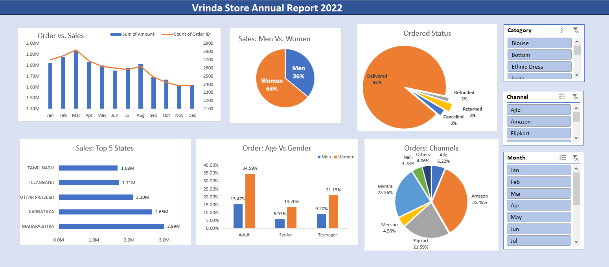

# 👋 Hello, I'm Bhudeep pal
**Data Analytics | SQL | Power BI | Python | Business Intelligence | Data Storyteller**

👋 **About Me**

I am a data-driven problem solver with expertise in SQL, Python, Power BI, and Advanced Excel, passionate about transforming raw data into actionable insights. My experience includes:   
✅ Developing interactive dashboards that improve decision-making efficiency. 
✅ Automating data pipelines for scalable and error-free reporting. 
✅ Applying statistical analysis to optimize business strategies. 
✅ Leveraging machine learning models for predictive analytics. 

🔧 **Technical Skills**  
**Languages:** SQL, Python (Pandas, NumPy, Matplotlib, Seaborn)  
**Databases:** MySQL, MongoDB, Snowflake  
**BI Tools:** Power BI, Tableau  
**Excel:** Pivot Tables, Power Query, DAX  
**Other:** ETL, Data Wrangling, Business Intelligence  

---

## 🚀 **Projects Showcase**

### 📊 Project 1: **[Black friday Sales Analysis]([GitHub_Project_Link](https://github.com/NoOne051198/Black-friday-sales-analysis.git))**
**Key Skills:** `Python` `Pandas` `Numpy` `Matplotlib`  
📖 **Description:** Briefly describe what the project does and its impact. 

)

---

### 📈 Project 2: **[Walmart Sales Pridiction ]([GitHub_Project_Link](https://github.com/NoOne051198/WalmartSalesPredion2))**
**Key Skills:** `Machine Learning` `scikit-learn` `XGBoost`  
📖 **Description:** Describe your role and what you achieved.  

---

### 📈 Project 3: **[Vrinda Store Sales Report ](https://github.com/NoOne051198/vrinda-store-report)**
**Key Skills:** `Data Analysis`, `Advanced Excel` `Formulae` `Data Cleaning`, `Data Processing`,`Pivot Table and Pivot charts`, `Data-driven Insights`.   
📖 **Description:** As a Data Analyst, Our aim was to find the insights to increase the revenue in upcomming Year.   
- **Deliverable insights:**
 1. Women contributed ~65% of total purchases.
 2. Maharashtra, Karnataka, and Uttar Pradesh accounted for ~35% of total sales.
 3. Adults (30-49 years) made up ~50% of the total orders.
 4. Amazon, Flipkart, and Myntra collectively contributed ~80% of total sales.

---
## 📫 **Connect with Me**  
💼 [LinkedIn](https://www.linkedin.com/in/bhudeep-pal/) | | 📧 Email: bhudeep555pal@gmail.com

---

⭐ **If you like my work, consider giving this repository a star!**  

