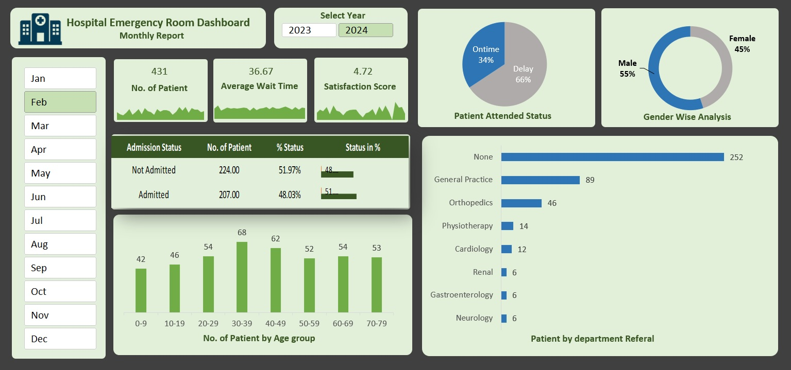

# 👋 Hello, I'm Bhudeep pal
**Data Analytics | SQL | Power BI | Python | Business Intelligence | Data Storyteller**

 **About Me**

I am a data-driven problem solver with expertise in SQL, Python, Power BI, and Advanced Excel, passionate about transforming raw data into actionable insights. My experience includes:   
✅ Developing interactive dashboards that improve decision-making efficiency. 
✅ Automating data pipelines for scalable and error-free reporting. 
✅ Applying statistical analysis to optimize business strategies. 
✅ Leveraging machine learning models for predictive analytics. 

🔧 **Technical Skills**  
**Languages:** SQL, Python (Pandas, NumPy, Matplotlib, Seaborn)  
**Databases:** MySQL, MongoDB, Snowflake  
**BI Tools:** Power BI, Tableau  
**Excel:** Pivot Tables, Power Query, DAX  
**Other:** ETL, Data Wrangling, Business Intelligence  

---

## 🚀 **Projects Showcase**

### 📊 Project 1: **[Black Friday Sales Analysis](https://github.com/NoOne051198/Black-friday-sales-analysis.git)**
**Key Skills:** `Python` `Pandas` `Numpy` `Matplotlib`  `Data Analysis` `Data Cleaning`  
📖 **Description:** 
- Leveraged Python for comprehensive analysis of consumer purchasing behaviors in sales events; insights generated led to a refined approach in targeting campaigns, improving engagement metrics by over 20% within 3 months..
-	Generated over 15 detailed graphical representations illustrating customer spending habits via Matplotlib library; each graphic played a pivotal role in shaping effective market outreach programs tailored to target demographics.
  
- **Deliverable insights:**
 1. Our mostly customers lie in the 26 to 35 age group. 
 2. Our most customers lie in Category B, and they stay in the city for one year approx. 
 3. Unmarried purchase more than married.
 4. Product of category 5 is most famous product category.
 5. Purchase price data is right skewed distribution. 

)

---

### 📈 Project 2: **[Walmart Sales Prediction](https://github.com/NoOne051198/WalmartSalesPredion2)**
**Key Skills:** `Machine Learning` `scikit-learn` `XGBoost` `Exploratory data Analysis` `Data Preprocessing` `Random forest`  
📖 **Description:** 
- Perform Exploratory data Analysis.
-	Data Preprocession
   `Imputting/Removing missing values`
  `Delete Duplicate records`
  `Check the Outliers`
- Preparing Data for Training
  `Split the Dataset into training and validation dataset`
  `Scaling the numberical features`
  `Encode the Categorical features`
- Model fitting and validation
  `Ramdom forest regressor`
  `Mean squared error`
  `Gradient Boosting Machine`
  `K fold cross validation`
- Hyperparameter tuning and Regularization
  `n_estimators` `max_depth` `max_leaf_node` `max_features` `min_sample_leaf` `min_sample_split` `bootstrap`  

---

### 📈 Project 3: **[Vrinda Store Sales Report ](https://github.com/NoOne051198/vrinda-store-report)**
**Key Skills:** `Data Analysis`, `Advanced Excel` `Formulae` `Data Cleaning`, `Data Processing`,`Pivot Table and Pivot charts`, `Data-driven Insights`.   
📖 **Description:** As a Data Analyst, Our aim was to find the insights to increase the revenue in upcomming Year.   
- **Deliverable insights:**
 1. Women contributed ~65% of total purchases.
 2. Maharashtra, Karnataka, and Uttar Pradesh accounted for ~35% of total sales.
 3. Adults (30-49 years) made up ~50% of the total orders.
 4. Amazon, Flipkart, and Myntra collectively contributed ~80% of total sales.

---

### 📈 Project 4: **[Hospital Emergency Room Dashboard](https://github.com/NoOne051198/vrinda-store-report)**
**Key Skills:**  `Advanced Excel` `Data visualization` `Data Modeling` `Power Query`  `Data Cleaning` `Data Processing` `Pivot Table and Pivot charts`  
📖 **Description:** As a Data Analyst, Our aim was to track the data according to months with KPIs. To track the records    

---
## 📫 **Connect with Me**  
💼 [LinkedIn](https://www.linkedin.com/in/bhudeep-pal/) | | 📧 Email: bhudeep555pal@gmail.com

---

⭐ **If you like my work, consider giving this repository a star!**  

